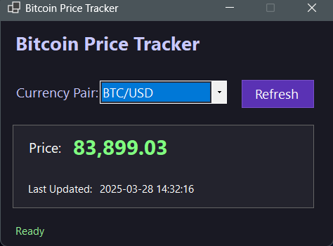

# Bitcoin Price Tracker

A Windows Forms application that provides real-time Bitcoin price tracking in multiple currency pairs. This application fetches live cryptocurrency market data using the Polygon.io API.

## Features

- Track Bitcoin prices in multiple currencies (USD, EUR, JPY, GBP, AUD)
- Automatic price refresh every 30 seconds
- Manual refresh option
- Clean, dark-themed user interface
- Real-time status updates and error handling
- Last updated timestamp display

## Screenshot

[]

## Requirements

- Windows OS
- .NET 8.0 or higher
- Polygon.io API key

## Installation

1. Clone this repository:
   ```
   git clone https://github.com/mars-rift/btcpairs.git
   ```

2. Open the solution in Visual Studio 2022 or later

3. Build the solution:
   ```
   dotnet build
   ```

4. Run the application:
   ```
   dotnet run
   ```

## API Key Setup

This application requires a Polygon.io API key to function. Follow these steps to set it up:

1. Sign up for a free API key at [Polygon.io](https://polygon.io/)
2. Set an environment variable named `POLYGON_API_KEY` with your API key:

   **Windows Command Line:**
   ```
   setx POLYGON_API_KEY "your-api-key-here"
   ```
   
   **Windows PowerShell:**
   ```
   [Environment]::SetEnvironmentVariable("POLYGON_API_KEY", "your-api-key-here", "User")
   ```

3. Restart your computer or IDE after setting the environment variable

## Usage

1. Launch the application
2. Select a currency pair from the dropdown menu
3. The current Bitcoin price will display immediately
4. Click "Refresh" to manually update the price
5. The price will automatically refresh every 30 seconds

## Dependencies

- System.Net.Http.Json (8.0.0)

## License

This project is licensed under the MIT License - see the LICENSE.txt file for details.

## Contributing

 Please feel free to submit a Pull Request.